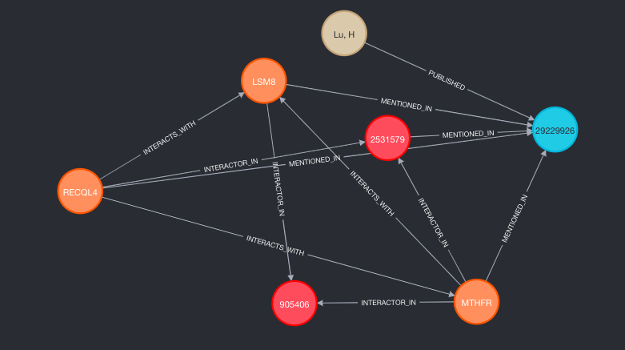
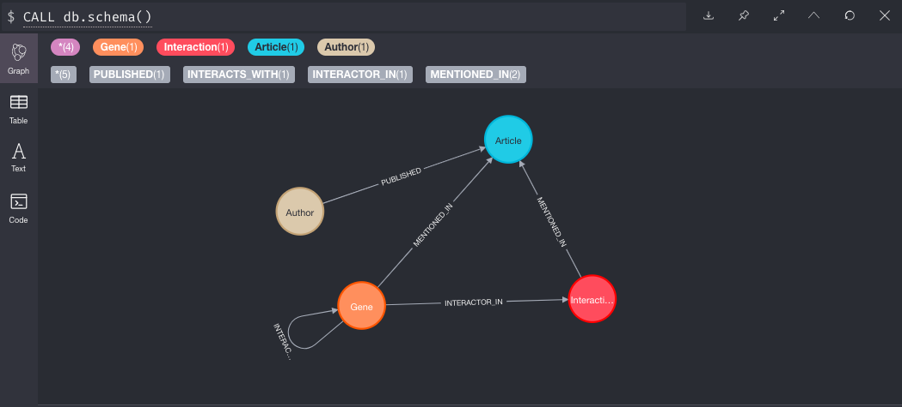

[![Contributors][contributors-shield]][contributors-url]
[![Forks][forks-shield]][forks-url]
[![Stargazers][stars-shield]][stars-url]
[![Issues][issues-shield]][issues-url]
[![LinkedIn][linkedin-shield]][linkedin-url]

# bioNX: Automated Knowledge Graph construction of PPI networks

## About the Project

The exponential accumulation of biological data presents a formidable challenge when it comes to integration of new knowledge leading to actionable insights. The `bioNX` project employs automated Knowledge Graph creation of protein-protein interaction networks using Neo4j as a way to demonstrate how such integration can be done.

Using a graph database makes it possible to explore the context and relationships in the data using various algorithms:
* Community detection
* Centrality to measure the importance of a node
* Similarity and prediction
* Predicting undiscovered relationships
* Finding the shortest paths between nodes

#### -- Project Status: [Active] 
*`bioNX` is a work in progress.*

## Current Data Sources
* [bioGRID](https://thebiogrid.org/) - primary data source for PPIs
* [HGNC](https://www.genenames.org/) - Gene nomenclature reference
* [PubMed](https://pubmed.ncbi.nlm.nih.gov/) - Literature
* [Uniprot](https://www.uniprot.org/) - Protein properties (*pending implementation*)
* [Entrez](https://www.ncbi.nlm.nih.gov/Web/Search/entrezfs.html) - Gene properties (*pending implementation*)
* [GO](http://geneontology.org/) - Gene properties (*pending implementation*)

## Prerequisites
1. [BioGRID Access Key](https://webservice.thebiogrid.org/)
2. [Neo4j](https://neo4j.com/)

## Getting Started

### 1. Installation
Clone repo:
```sh
git clone https://github.com/abk7777/bioNX
```

Install Python libraries:
```sh
cd bioNX
pip install -r requirements.txt
```

Update the `.env` file with the correct values:
```sh
BIOGRID_ACCESS_KEY=<BIOGRID_ACCESS_KEY>
NEO4J_USERNAME=<NEO4J_USERNAME>
NEO4J_PASSWORD=<NEO4J_PASSWORD>
NEO4J_BOLT_URL=bolt://localhost:7687
NEO4J_HOME=<NEO4J_HOME>
```
Make the data directory:
```sh
cd bioNX
mkdir -p data/clean/
```

### 2. Run Jupyter Notebook
Start Jupyter Notebook:
```sh
cd notebooks/ && \
jupyter notebook
```
Open the notebook `0.1-biogrid-data.ipynb` and run its contents. This will output a file named `biogrid_ppi_data.csv` to the import directory in the `$NEO4J_HOME` folder and place a copy of it in the `data/clean/` directory for easy access. 

To specify a gene, update the `gene` parameter under the section **Select Gene**. Take note that API requests are throttled to 10 per second, which means that it is wise to limit the results using the `limit` parameter so it doesn't take forever to fetch the data.

### 3. Load the graph in Neo4j

The simplest way to load the graph into Neo4j is to copy and paste the `neo4j/load.cyp` script into Neo4j and run it.

## Usage

Example Cypher query returning genes, interactions, and author for MTHFR gene mentioned in [PubMed article "26186194"](https://pubmed.ncbi.nlm.nih.gov/26186194/):
```cypher
MATCH (gene1:Gene { name: 'MTHFR' })-[:INTERACTS_WITH]-(gene2:Gene),
(gene1)-[:MENTIONED_IN]->(article:Article { pubmed_id:"26186194" })<-[:MENTIONED_IN]-(gene2), 
(article)<-[:PUBLISHED]-(author:Author), 
(gene1)-[:INTERACTOR_IN]->(interaction:Interaction)<-[:INTERACTOR_IN]-(gene2)
RETURN gene1, gene2, author, article, interaction;
```


## Roadmap

### Current Functionality
Running `load.cyp` in Neo4j will produce a graph containing the following schema:

* `(Gene)-[:INTERACTOR_IN]->(Interaction)`
* `(Gene)-[:INTERACTS_WITH]-(Gene)`
* `(Interaction)-[:MENTIONED_IN]->(Article)`
* `(Gene)-[:MENTIONED_IN]->(Article)`
* `(Author)-[:PUBLISHED]->(Article)`



### Future Implementations
See the [open issues](https://github.com/abk7777/bioNX/issues) for a list of proposed features (and known issues). The current planned implementation includes:
* Expand graph schema with nodes for: 
  * Protein complexes
  * Cofactors
  * RNAs
  * KEGG Pathways
  * Post-Translation Modifications
  * Chromosome loci
  * Subcellular location
  * Tissue
  * Organ
  * Disease Condition

Please feel free to include suggestions for things like:
* Nodes, relationships and properties
* Data sources
* Functionality and features
* Bug fixes

## Built With

* [Python](https://docs.python.org/3/)
* [Neo4j](https://neo4j.com/)

## Contributing

While the project is still getting off the ground please feel free to start a discussion in the [open issues](https://github.com/abk7777/bioNX/issues). 

## Contact

Gregory Lindsey - [@abk7x4](https://twitter.com/abk7x4) - gclindsey@gmail.com

Project Link: [https://github.com/abk7777/bioNX](https://github.com/abk7777/bioNX)

[contributors-shield]: https://img.shields.io/github/contributors/abk7777/bioNX.svg?style=flat-square
[contributors-url]: https://github.com/abk7777/bioNX/graphs/contributors
[forks-shield]: https://img.shields.io/github/forks/abk7777/bioNX.svg?style=flat-square
[forks-url]: https://github.com/abk7777/bioNX/network/members
[stars-shield]: https://img.shields.io/github/stars/abk7777/bioNX.svg?style=flat-square
[stars-url]: https://github.com/abk7777/bioNX/stargazers
[issues-shield]: https://img.shields.io/github/issues/abk7777/bioNX.svg?style=flat-square
[issues-url]: https://github.com/abk7777/bioNX/issues
[linkedin-shield]: https://img.shields.io/badge/-LinkedIn-black.svg?style=flat-square&logo=linkedin&colorB=555
[linkedin-url]: https://linkedin.com/in/gregory-lindsey/